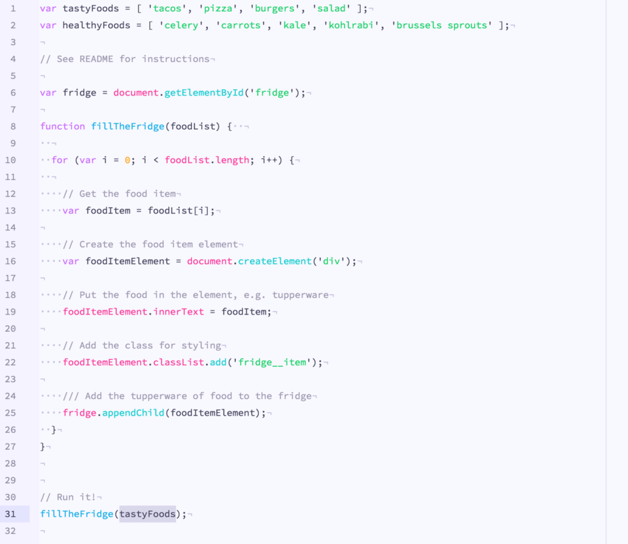

**Tinacious Design Light Syntax** is a light syntax theme that uses a bright palette of colours including pink, blue, turquoise, green, purple, and orange.

It is a light variation of the original [Tinacious Design Syntax theme](https://github.com/tinacious/atom-tinacious-design-syntax).

Colours curated by Web and Mobile designer and developer Tina from [Tinacious Design](http://tinaciousdesign.com).

### JavaScript

### React (JSX)

## Changelog

### 1.0.0 - Initial Release
- Initial release
